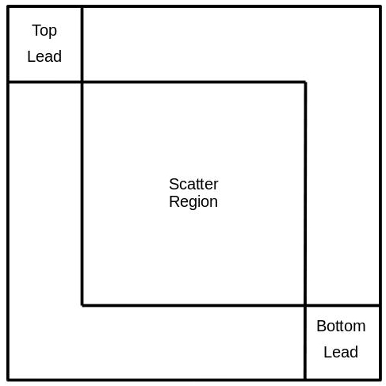

.. module:: source.electron_transport

The Electron Transport Calculator
=================================

Class for setting up and performing an electron transport calculation using the
Hamiltonian and overlap matrix from a previous quantum mechanical calculation.
The interface structure is split into three sections; two leads and a scatter
region. The two leads are defined by the number of layers of unit cells in each
lead.  The scatter region is the rest of the interface structure.
The Hamiltonian matrix is divided as:

The matrices have the following dimensions:

TL : N1xN1 : N1 = number of atoms in top lead * basis functions per atom

BL : N2xN2 : N2 = number of atoms in bottom lead * basis functions per atom

scatter : NxN : N = total number of basis functions - N1 - N2

Coupling matrices are generated either from the coupling between layers in
TL and BL or from the off-diagonal elements at the intersection of TL/BL
and scatter.

A restart file is generated if restart = False that is read back in if
restart = True.

For testing purposes, options are included for replacing the overlap matrix
with the identity matrix and replacing the inter-layer coupling with the
coupling between the layers in the top lead.

_________

.. autoclass:: ElectronTransport
